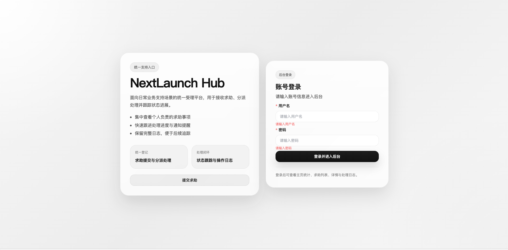

# NextLaunch Hub

NextLaunch Hub 是一个前后端分离的求助协同系统，当前已覆盖从公开发起、后台处理、协同参与、通知提醒到超时预警的完整链路。


## 技术栈

- 前端：Vue 3、Vite、Vue Router、Pinia、Element Plus、Axios
- 后端：Node.js、Express、MySQL、mysql2、JWT、bcryptjs、dotenv、cors

## 当前已实现能力

- 用户登录与角色区分：`admin`、`helper`、`requester`
- 未登录提交求助
- 公开求助查询与发起人确认/退回
- 求助中心列表、详情、状态流转
- 协同人员添加与协同处理记录
- 管理员改派帮助人员
- 通知中心、未读统计、分页筛选、已读操作
- 工作台首页统计、快捷入口、待办区、最近记录
- 求助日志时间线
- 超时预警：
  - 默认 24 小时处理时限
  - 自动计算截止时间
  - 支持手动执行超时检查
  - 首页统计超时数
  - 列表和详情展示超时状态

## 项目结构

```text
NextLaunchHub
├── README.md
├── .gitignore
├── server
│   ├── .env.example
│   ├── package.json
│   ├── sql
│   │   ├── schema.sql
│   │   └── seed.sql
│   └── src
└── web
    ├── .env.example
    ├── package.json
    ├── vite.config.js
    └── src
```

## 环境要求

- Node.js 18+
- npm 9+
- MySQL 8+

检查命令：

```bash
node -v
npm -v
mysql --version
```

## 安装说明

首次拉起项目时，需要分别安装前后端依赖：

```bash
cd server
npm install

cd ../web
npm install
```

如果你只是继续拉取我这次的代码变更，而 `package.json` 没有变化，则通常不需要重新执行 `npm install`。

只有下面两种情况建议重新安装：

- 你的 `node_modules` 不存在
- `package.json` 或 `package-lock.json` 发生变化

## 环境变量

后端：

```bash
cd server
cp .env.example .env
```

示例：

```env
PORT=3000
DB_HOST=127.0.0.1
DB_PORT=3306
DB_USER=root
DB_PASSWORD=123456
DB_NAME=nextlaunch_hub
JWT_SECRET=nextlaunch-hub-local-secret
JWT_EXPIRES_IN=7d
CORS_ORIGIN=http://localhost:5173
```

前端：

```bash
cd web
cp .env.example .env
```

示例：

```env
VITE_API_BASE_URL=/api
```

## 数据库初始化

首次初始化：

```bash
mysql -uroot -p < server/sql/schema.sql
mysql -uroot -p < server/sql/seed.sql
```

默认数据库名：

```text
nextlaunch_hub
```

## 数据库升级说明

这次更新不需要整库重新导入。

如果你已经有现成数据库，只需要执行本次增量 SQL 即可，不需要重新跑 `schema.sql` 和 `seed.sql`。

推荐顺序：

1. 备份现有数据库
2. 执行本次增量 SQL
3. 重启后端服务
4. 刷新前端页面验证

只有在你希望重建一套全新本地环境时，才需要重新导入完整数据库。

## 启动方式

后端开发启动：

```bash
cd server
npm run dev
```

后端生产启动：

```bash
cd server
npm start
```

前端开发启动：

```bash
cd web
npm run dev
```

默认访问地址：

- 前端：`http://localhost:5173`
- 后端：`http://localhost:3000`

健康检查：

- `GET /api/health`

## 默认测试账号

默认密码：

```text
123456
```

管理员：

```text
admin
```

帮助人员：

```text
helper.chen
helper.lin
helper.zhou
```

## 主要接口

认证与公开接口：

- `POST /api/auth/login`
- `GET /api/public/requesters?keyword=`
- `GET /api/public/helpers?keyword=`
- `POST /api/public/help-requests`
- `GET /api/public/help-requests/query`
- `POST /api/public/help-requests/:id/confirm`

求助单接口：

- `GET /api/help-requests`
- `GET /api/help-requests/:id`
- `PATCH /api/help-requests/:id/status`
- `PATCH /api/help-requests/:id/reassign-helper`
- `GET /api/help-requests/:id/assistants`
- `POST /api/help-requests/:id/assistants`
- `POST /api/help-requests/:id/collaboration-log`
- `POST /api/help-requests/check-timeout`

通知与统计：

- `GET /api/dashboard/overview`
- `GET /api/notifications`
- `PATCH /api/notifications/:id/read`
- `PATCH /api/notifications/read-all`
- `GET /api/notifications/unread-count`

## Git 提交建议

当前仓库之前没有根级 `.gitignore`，所以这些内容会直接出现在 `git status` 里：

- `server/node_modules/`
- `web/node_modules/`
- `.env`
- `.DS_Store`

现在已经补了根级 `.gitignore`，后续这些文件不会再被新加入版本控制。

如果某些缓存文件已经被你执行过 `git add`，需要先从索引移除，再重新提交：

```bash
git rm -r --cached server/node_modules web/node_modules
git rm --cached .DS_Store
```

然后再执行：

```bash
git status
git add .
git commit -m "chore: update ignore rules"
```

说明：

- `node_modules` 不应该提交
- `package-lock.json` 建议提交
- `.env` 不应该提交
- `.env.example` 应该保留提交

## 联调检查清单

1. 登录后台，进入 `/dashboard`
2. 检查统计卡片是否包含“超时求助数”
3. 打开 `/help-center`，确认超时项有明显标签和高亮
4. 打开任意求助详情，确认能看到截止时间和超时状态
5. 打开通知中心，检查未读数与分页是否正常
6. 如需验证超时逻辑，可调用：

```bash
POST /api/help-requests/check-timeout
```

### 3. 提交求助检查

- 打开 `http://localhost:5173/help-request`
- 发起人姓名可通过后端检索
- 帮助人员可通过后端检索
- 提交成功后弹窗显示求助单号

### 4. 列表权限检查

使用 `helper.chen / 123456` 登录：

- 进入 `/help-center`
- 只能看到分配给陈志远的求助单

使用 `admin / 123456` 登录：

- 进入 `/help-center`
- 可以看到全部求助单

### 5. 详情与状态检查

- 点击列表中的“查看详情”
- 详情页能显示完整字段
- 点击“标记为处理中 / 待确认 / 已完成”
- 状态变更后详情页应刷新
- 日志列表应新增一条状态变更记录

### 6. 通知检查

- 提交求助后，`notifications` 表会新增一条发给对应帮助人员的通知
- 状态更新后，`notifications` 表会新增一条发给发起人的通知

## 十一、常见问题

### 1. 前端请求失败或跨域报错

优先检查：

- 后端是否已启动
- 前端是否通过 `npm run dev` 启动
- 后端 `.env` 中 `CORS_ORIGIN` 是否为 `http://localhost:5173`
- 前端 `VITE_API_BASE_URL` 是否为 `/api`

### 2. 登录失败

优先检查：

- 是否已执行 `seed.sql`
- 数据库连接信息是否正确
- `users` 表中是否存在初始化账号

### 3. 页面没有数据

优先检查：

- `help_requests` 表是否已导入初始化数据
- 后端控制台是否有报错
- 浏览器开发者工具的 Network 中接口是否返回 `code: 0`

## 十二、补充说明

当前终端环境如果未安装 Node.js，将无法直接在当前会话中执行 `npm install` 和 `npm run dev`。这种情况下，请在你本地终端中按本说明执行即可。
